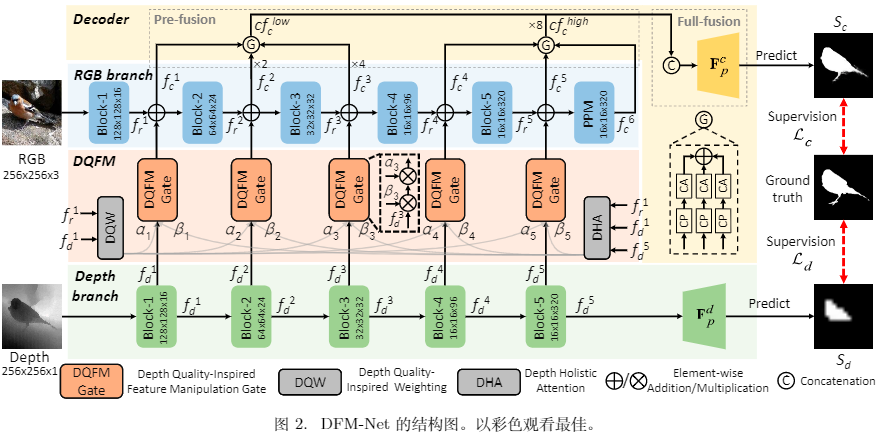
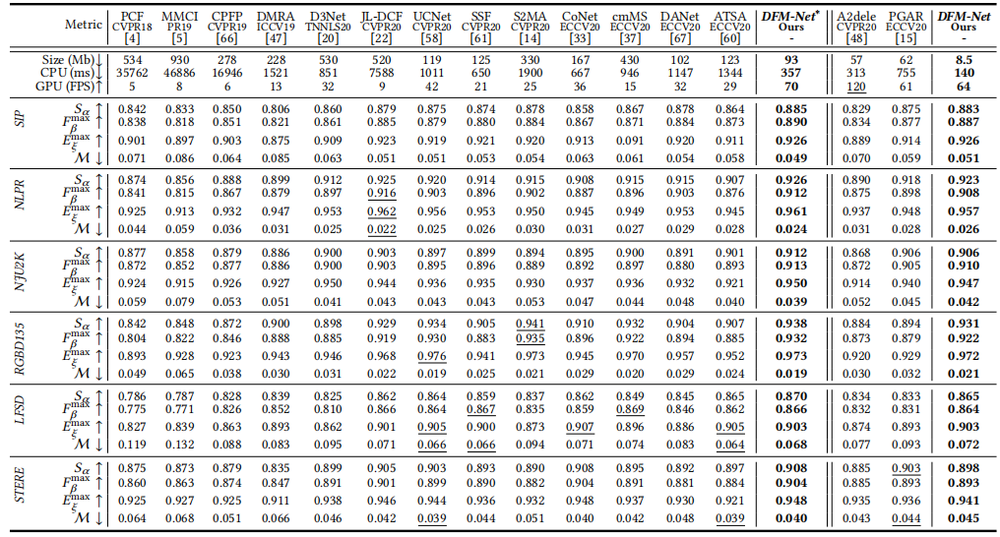
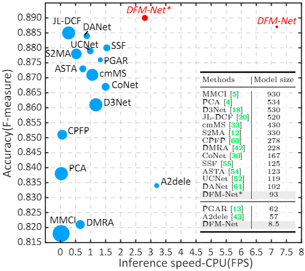

# DFM-Net (ACM MM 2021)
This repository provides code for paper [Depth Quality-Inspired Feature Manipulation for Efficient RGB-D Salient Object Detection](https://arxiv.org/pdf/2107.01779.pdf). 

This method contains hyper light-weight RGB-D SOD model DFM-Net and its big version DFN-Net*. 

If you have any questions about our paper, feel free to contact us. 

      
 <em> 
     Block diagram of the proposed DFM-Net.
    </em>

## Features
- High accuracy: Experiments on 6 public datasets demonstrate that the proposed DFM-Net achieves state-of-the-art performance even compared to non-light-weight models.
- High Speed: cost 140ms on CPU (Core i7-8700 CPU), which is **2.2× faster than the prior fastest** efficient model A2dele.
- Low model size: Without any general model compression technology (such as quantification, distillation), its model size is only **8.5Mb**, which is **14.9% of the prior smallest** model A2dele.

## Easy-to-use to boost your methods
If you use a depth branch as an affiliate to RGB branch:
- Use DQW/DHA to boost performace with extra 0.007/0.042Mb model size increased
- Use our light-weight depth backbone to improve efficiency

if you adopt parallel encoders for RGB and depth:
- refer to our another work [BTS-Net](https://github.com/zwbx/BTS-Net)

## Performance

      
 <em> 
     Quantitative comparison with 15 SOTA over 4 metrics (S-measure, max F-measure, max E-measure and MAE) on 6 datasets. Our results are highlighted in bold, and the scores/numbers better than ours are underlined.
    </em>

      
 <em> 
      Performance visualization. The vertical axis indicates the accuracy on SIP. The horizontal axis indicates the CPU speed (FPS). The circle area is proportional
to the model size.
    </em>

## Data Preparation

 - Download the raw data from [Here](https://pan.baidu.com/s/1wI-bxarzdSrOY39UxZaomQ) [code: 940i] and a pretrained model (DFMNet_300_epoch.pth) from [Here](https://pan.baidu.com/s/1Dk7CS3tp4P9nES5GdC908Q)
[code: ko6s]. Note that the parameter file is 8.9Mb, which is 0.4Mb bigger than we claim in the paper because keys denoting parameter names also ocuupy some space. Then put them under the following directory:
 
        -dataset\ 
          -NJU2K\  
          -NLPR\
          ...
        -pretrain
          -DFMNet_300_epoch.pth
          ...
	  
## Testing

    Directly run test.py
    
    The test maps will be saved to './resutls/'.
   
- We provide testing results of above datasets for DFM-Net and the big version DFM-Net*.
	[results of DFM-Net](https://pan.baidu.com/s/1e3iqZZHGjy2OAUxVwHhDeg) [code: 0ybv].
	[results of DFM-Net*](https://pan.baidu.com/s/1kwp9Y8lbwnXhLgMuaVjgrA) [code: mho4].

- Evaluate the result maps:
	You can evaluate the result maps using the tool in [Matlab Version](http://dpfan.net/d3netbenchmark/) or [Python_GPU Version](https://github.com/zyjwuyan/SOD_Evaluation_Metrics).
    
- If you need the training code, please send to the email (zhangwenbo@scu.stu.edu.cn). Our another work [BTS-Net](https://github.com/zwbx/BTS-Net)
  use the same training code, hyperparameter needs to be modified.
 
## Citation

Please cite the following paper if you use this repository in your reseach

	@inproceedings{zhang2021depth,
  title={Depth quality-inspired feature manipulation for efficient RGB-D salient object detection},
  author={Zhang, Wenbo and Ji, Ge-Peng and Wang, Zhuo and Fu, Keren and Zhao, Qijun},
  booktitle={Proceedings of the 29th ACM International Conference on Multimedia},
  pages={731--740},
  year={2021}
}
