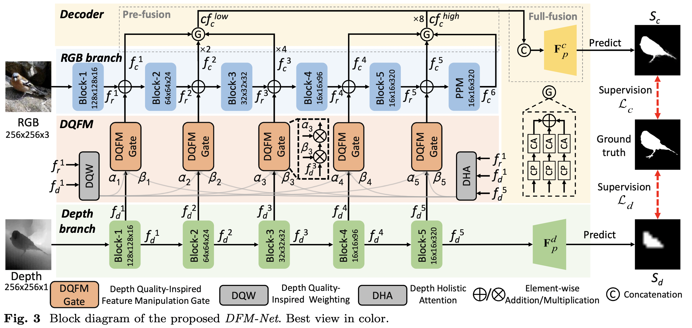
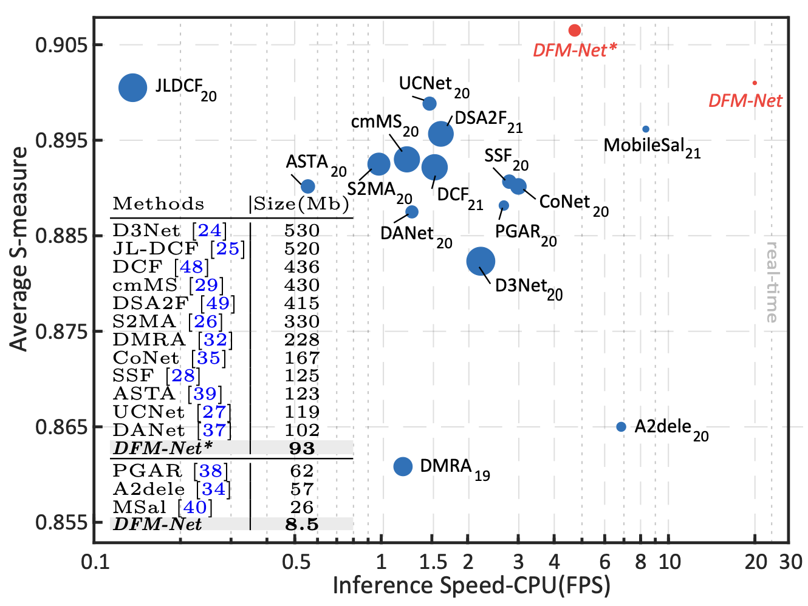

# DFM-Net (ACM MM 2021)
Official repository for paper [Depth Quality-Inspired Feature Manipulation for Efficient RGB-D Salient Object Detection](https://arxiv.org/pdf/2107.01779.pdf) | [中文版](https://pan.baidu.com/s/1axKXAqBmMmQuPTvTTY_LNg?pwd=jsvr)

## News
- 6/Jun/2022🔥[online demo](http://rgbdsod-krf.natapp4.cc/) is newly realeased!
- 8/Aug/2022 we extend DFM-Net to Video Salient Object Detection task, which refers to [Depth Quality-Inspired Feature Manipulation for Efficient RGB-D and Video Salient Object Detection](https://arxiv.org/abs/2208.03918)

      
 <em> 
     Block diagram of DFM-Net.
    </em>

## The most efficient RGB-D SOD method &#x26A1;
- Low model size: Model size is only **8.5Mb**, being **6.7/3.1 smaller** than the latest lightest models A2dele and MobileSal.
- High accuracy: SOTA performance on 9 datasets (NJU2K, NLPR, STERE, RGBD135, LFSD, SIP, DUT-RGBD, RedWeb-S, COME). 
- High Speed: Cost 50ms on CPU (Core i7-8700 CPU), being **2.9/2.4 faster** than the latest fastest models A2dele and MobileSal.

      
 <em> 
      Performance visualization. Performance visualization. The vertical axis indicates the average S-measure over six widely used datasets (NJU2K, NLPR, STERE, RGBD135, LFSD, SIP). The horizontal axis indicates CPU speed. The circle area is proportional to the model size. 
    </em>

##  Extension :fire:
[Depth Quality-Inspired Feature Manipulation for Efficient RGB-D and Video Salient Object Detection](https://arxiv.org/abs/2208.03918)
- More comprehensive comparison: 
  - Benchmark results on DUT-RGBD, RedWeb-S, COME are updated. 
  - Metric of maximum-batch inference speed is added.
  - We re-test the inference speed of ours and compared methods on Ubuntu 16.04.
- Working mechanism explanation 
  - Further analyses verify the ability of DQFM in distinguishing depth maps of various qualities without any quality labels.
- Application on efficient VSOD
  - One of the lightest VSOD methods! 
  - Joint training strategy is proposed.

## Easy-to-use to boost your RGB-D SOD network
If you use a depth branch as an affiliate to the RGB branch:
- Use DQW/DHA to boost performance with extra 0.007/0.042Mb model size increased
- Use our light-weight depth backbone to improve efficiency

if you adopt parallel encoders for RGB and depth:
- refer to our other work [BTS-Net](https://github.com/zwbx/BTS-Net)

## Test

Directly run test.py
    
    The test maps will be saved to './resutls/'.
    
data preparation
 - Classic benchmark: training on NJU2K and NLPR and test on NJU2K, NLPR, STERE, RGBD135, LFSD, SIP. 
   - [test data](https://pan.baidu.com/s/1wI-bxarzdSrOY39UxZaomQ) [code: 940i]
   - [pretrained model for DFMNet](https://pan.baidu.com/s/1pTEByo0OngNJlKCJsTcx-A?pwd=skin)
   - Additional test datasets [RedWeb-S](https://github.com/nnizhang/SMAC) &#x1F195;, updated in journal version.
 - DUT-RGBD benchmark &#x1F195;
   - Download the training and test data in [official repository](https://pan.baidu.com/s/1mhHAXLgoqqLQIb6r-k-hbA). 
   - [pretrained model for DFMNet](https://pan.baidu.com/s/1GJHvxh2gTLutpM1hfESDNg?pwd=nmw3).
 - COME benchmark &#x1F195;
   - Download the training and test data in [official repository](https://github.com/JingZhang617/cascaded_rgbd_sod).
   - [pretrained model for DFMNet](https://pan.baidu.com/s/1fCYF5p9dCC8RXRCLaWUQlg?pwd=iqyf).

## Results

- We provide testing results of 9 datasets (NJU2K, NLPR, STERE, RGBD135, LFSD, SIP, DUT-RGBD &#x1F195;, RedWeb-S &#x1F195;, COME &#x1F195;).
  - [Results of DFM-Net](https://pan.baidu.com/s/1wZyYqYISpRGZATDgKYO4nA?pwd=4jqu).
  - [Results of DFM-Net*](https://pan.baidu.com/s/1vemT9nfaXoSc_tqSYakSCg?pwd=pax4). 

- Evaluate the result maps:
	You can evaluate the result maps using the tool in [Matlab Version](http://dpfan.net/d3netbenchmark/) or [Python_GPU Version](https://github.com/zyjwuyan/SOD_Evaluation_Metrics).
	
 - Note that the parameter file is 8.9Mb, which is 0.4Mb bigger than we report in the paper because keys denoting parameter names also occupy some space. Then put them under the following directory:
 
        -dataset\ 
          -RGBD_train
          -NJU2K\  
          -NLPR\
          ...
        -pretrain
          -DFMNet_300_epoch.pth
          ...

    
## Training
- Download [training data](https://pan.baidu.com/s/1ckNlS0uEIPV-iCwVzjutsQ)(eb2z)
- Modify setting in options.py and run train.py

##  Application on VSOD &#x1F195;
- We provide testing results of 4 datasets (DAVIS, FBMS, MCL, DAVSOD).
  - [Results of DFM-Net](https://pan.baidu.com/s/1jLGP2kV_Z7esOkkY3jKFQw?pwd=58wc).
  - [Results of DFM-Net*](https://pan.baidu.com/s/1EV4_neyES7jAyo0op-XfTA?pwd=pp2w). 
 
## Citation

Please cite the following paper if you use this repository in your research

	@inproceedings{zhang2021depth,
  	title={Depth quality-inspired feature manipulation for efficient RGB-D salient object detection},
 	author={Zhang, Wenbo and Ji, Ge-Peng and Wang, Zhuo and Fu, Keren and Zhao, Qijun},
  	booktitle={Proceedings of the 29th ACM International Conference on Multimedia},
  	pages={731--740},
	year={2021}
	}
	
	@artical{zhang2022depth,
  	title={Depth Quality-Inspired Feature Manipulation for Efficient RGB-D and Video Salient Object Detection},
 	author={Zhang, Wenbo and  Fu, Keren and  Wang, Zhuo and Ji, Ge-Peng and Zhao, Qijun},
  	booktitle={arXiv:2208.03918},
	year={2022}
	}
